# Диаграмма классов проектирования (упрощённая, без связей с DTO)

### Система помощи мигрантам

Упрощённый вариант: DTO-классы показаны с полным набором полей, но без линий-связей —
ни к мапперам, ни между собой, ни к `Operators`, — чтобы не перегружать схему и
сосредоточиться на доменной модели и слоях. Полная версия со всеми связями — в основном файле.

Диаграмма построена по последней версии кода и согласована с диаграммами коммуникаций:
каждый участник диаграмм коммуникаций представлен классом, каждое сообщение — операцией,
а связи (зависимости/ассоциации/реализации) отражают вызовы между объектами.

Ключевые проектные решения, видимые на диаграмме:

- **Dependency Inversion:** `Rule` и `Condition` зависят от абстракции `RuleSubjectInterface`, а не от `Migrant`; `Migrant` её реализует. Цикла «rule ↔ migrant» нет.
- **Агрегат:** `Rule` — корень агрегата, владеет `Condition` (композиция, cascade + orphanRemoval).
- **Слои:** `web.controller → domain.service → domain.repository`; мапперы изолируют DTO; `Comparisons` — доменный помощник в `domain.support`.

```plantuml
@startuml ClassDiagramSimple
skinparam linetype ortho
hide empty members
left to right direction

' ===== domain.model.user =====
package "domain.model.user" {
    interface OwnedByUserInterface {
        + getUser(): User
    }

    enum UserRoles {
        USER
        ADMIN
        - value: String
        + getValue(): String
    }

    class User <<entity>> {
        - id: Integer
        - login: String
        - password: String
        - firstName: String
        - lastName: String
        - role: UserRoles
        - created: LocalDateTime
        - updated: LocalDateTime
    }
}

' ===== domain.model.migrant =====
package "domain.model.migrant" {
    class Country <<entity>> {
        - id: Integer
        - name: String
    }

    class PurposeOfVisit <<entity>> {
        - id: Integer
        - name: String
    }

    class Migrant <<entity>> {
        - id: Integer
        - entryDate: LocalDate
        - plannedDurationOfStay: Integer
        - hqsOrFamilyMember: boolean
        - hasFingerprinting: boolean
        - hasPhotoRegistration: boolean
        - hasMigrationRegistration: boolean
        - hasMedicalInsurance: boolean
        - hasMedicalExamination: boolean
        - hasRussianLanguageCert: boolean
        - hasInn: boolean
        - resettlementParticipant: boolean
        - hasUssrCertificate: boolean
        - hasRussianDiploma: boolean
        + getFieldValue(field: String): Object
        + getEntryDate(): LocalDate
        + getUser(): User
    }
}

' ===== domain.model.rule =====
package "domain.model.rule" {
    interface RuleSubjectInterface {
        + getFieldValue(field: String): Object
        + getEntryDate(): LocalDate
    }

    enum Operators {
        EQ
        NO_EQ
        GT
        LT
        GTE
        LTE
        IN
        NOT_IN
        + {abstract} check(actual: Object, expected: String): boolean
    }

    class Rule <<entity>> {
        - id: Integer
        - title: String
        - description: String
        - requiredResult: String
        - requiredAction: String
        - period: Integer
        - effectiveFrom: LocalDate
        - effectiveTo: LocalDate
        + addCondition(c: Condition): void
        + replaceConditions(list: List<Condition>): void
        + matches(subject: RuleSubjectInterface): boolean
        + calculateDeadline(subject: RuleSubjectInterface): LocalDate
    }

    class Condition <<entity>> {
        - id: Integer
        - field: String
        - operator: Operators
        - value: String
        + matches(subject: RuleSubjectInterface): boolean
    }
}

' ===== domain.support =====
package "domain.support" {
    class Comparisons <<utility>> {
        + {static} equalsValue(actual: Object, expected: String): boolean
        + {static} compare(actual: Object, expected: String): int
        + {static} containsIn(actual: Object, expected: String): boolean
        + {static} unwrapEntity(value: Object): Object
    }
}

' ===== domain.model.roadmap =====
package "domain.model.roadmap" {
    class RoadMap {
        + getSteps(): List<Step>
        + setSteps(steps: List<Step>): void
    }

    class Step {
        - title: String
        - deadline: LocalDate
        - message: String
    }
}

' ===== domain.repository =====
package "domain.repository" {
    interface UserRepository <<repository>> {
        + findByLoginIgnoreCase(login: String): Optional<User>
    }
    interface MigrantRepository <<repository>> {
        + findByUserLogin(login: String): Optional<Migrant>
    }
    interface CountryRepository <<repository>>
    interface PurposeOfVisitRepository <<repository>>
    interface RuleRepository <<repository>> {
        + findEffectiveOn(date: LocalDate): List<Rule>
        + findAllWithConditions(): List<Rule>
    }
}

' ===== domain.service =====
package "domain.service" {
    class UserService <<service>> {
        + createUser(login: String, password: String): User
        + getUser(id: Integer): User
        + getCurrentUser(): User
        + getCurrentUserLogin(): String
    }

    class AccessGuard <<service>> {
        + checkOwnerOrAdmin(entity: OwnedByUserInterface): void
    }

    class MigrantService <<service>> {
        + createMigrant(body: CreateMigrantRequestBodyDto): Migrant
        + updateMigrant(body: UpdateMigrantRequestBodyDto): Migrant
        + getMigrant(id: Integer): Migrant
        + getCurrentMigrant(): Migrant
        + deleteMigrant(id: Integer): void
    }

    class RuleService <<service>> {
        + createRule(body: CreateRuleRequestBodyDto): Rule
        + updateRule(body: UpdateRuleRequestBodyDto): Rule
        + getRule(id: Integer): Rule
        + getRules(onlyActive: boolean): List<Rule>
        + deleteRule(id: Integer): void
        - buildConditions(dtos: List<RuleConditionDto>): List<Condition>
    }

    class RoadMapService <<service>> {
        + createRoadMap(): RoadMap
        - createSteps(subject: RuleSubjectInterface): List<Step>
        - generateMessage(rule: Rule, deadline: LocalDate): String
    }

    class ReferenceDataService <<service>> {
        + getAllCountries(): List<Country>
        + getAllPurposesOfVisit(): List<PurposeOfVisit>
    }
}

' ===== web.controller =====
package "web.controller" {
    class UserController <<controller>> {
        + createUser(dto: CreateUserRequestBodyDto): ResponseEntity<UserResponseDto>
        + getUser(id: Integer): ResponseEntity<UserResponseDto>
        + getCurrentUser(): ResponseEntity<UserResponseDto>
    }
    class MigrantController <<controller>> {
        + createMigrant(dto: CreateMigrantRequestBodyDto): ResponseEntity<MigrantResponseDto>
        + getMigrant(id: Integer): ResponseEntity<MigrantResponseDto>
        + updateMigrant(dto: UpdateMigrantRequestBodyDto): ResponseEntity<MigrantResponseDto>
        + deleteMigrant(id: Integer): ResponseEntity<>
        + getCurrentMigrant(): ResponseEntity<MigrantResponseDto>
    }
    class RoadMapController <<controller>> {
        + showRoadMap(): ResponseEntity<RoadMapResponseDto>
    }
    class RuleController <<controller>> {
        + create(dto: CreateRuleRequestBodyDto): ResponseEntity<RuleResponseDto>
        + get(id: Integer): ResponseEntity<RuleResponseDto>
        + getRules(onlyActive: boolean): ResponseEntity<List<RuleResponseDto>>
        + update(dto: UpdateRuleRequestBodyDto): ResponseEntity<RuleResponseDto>
        + delete(id: Integer): ResponseEntity
    }
    class ReferenceController <<controller>> {
        + getCountries(): ResponseEntity<CountryResponseDto>
        + getPurposesOfVisit(): ResponseEntity<PurposeOfVisitResponseDto>
    }
}

' ===== web.mapper =====
package "web.mapper" {
    class UserMapper <<mapper>> {
        + toResponseDto(user: User): UserResponseDto
    }
    class MigrantMapper <<mapper>> {
        + toResponseDto(migrant: Migrant): MigrantResponseDto
    }
    class RuleMapper <<mapper>> {
        + toResponseDto(rule: Rule): RuleResponseDto
    }
    class RoadMapMapper <<mapper>> {
        + toResponseDto(roadMap: RoadMap): RoadMapResponseDto
    }
    class ReferenceMapper <<mapper>> {
        + toCountryDto(c: Country): CountryResponseDto
        + toPurposeOfVisitDto(p: PurposeOfVisit): PurposeOfVisitResponseDto
    }
}

' ===== web.dto (плоские носители данных) =====
package "web.dto" {
    class CreateUserRequestBodyDto <<dto>> {
        - login: String
        - password: String
    }
    class UserResponseDto <<dto>> {
        - id: Integer
        - login: String
    }

    class CreateMigrantRequestBodyDto <<dto>> {
        - entryDate: LocalDate
        - plannedDurationOfStay: Integer
        - countryOfCitizenshipId: Integer
        - purposeOfVisitId: Integer
        - hqsOrFamilyMember: boolean
        - hasFingerprinting: boolean
        - hasPhotoRegistration: boolean
        - hasMigrationRegistration: boolean
        - hasMedicalInsurance: boolean
        - hasMedicalExamination: boolean
        - hasRussianLanguageCert: boolean
        - hasInn: boolean
        - resettlementParticipant: boolean
        - hasUssrCertificate: boolean
        - hasRussianDiploma: boolean
    }

    class UpdateMigrantRequestBodyDto <<dto>> {
        - id: Integer
        - entryDate: LocalDate
        - plannedDurationOfStay: Integer
        - countryOfCitizenshipId: Integer
        - purposeOfVisitId: Integer
        - hqsOrFamilyMember: Boolean
        - hasFingerprinting: Boolean
        - hasPhotoRegistration: Boolean
        - hasMigrationRegistration: Boolean
        - hasMedicalInsurance: Boolean
        - hasMedicalExamination: Boolean
        - hasRussianLanguageCert: Boolean
        - hasInn: Boolean
        - resettlementParticipant: Boolean
        - hasUssrCertificate: Boolean
        - hasRussianDiploma: Boolean
    }

    class MigrantResponseDto <<dto>> {
        - id: Integer
        - entryDate: LocalDate
        - plannedDurationOfStay: Integer
        - countryOfCitizenship: String
        - purposeOfVisit: String
        - hqsOrFamilyMember: boolean
        - hasFingerprinting: boolean
        - hasPhotoRegistration: boolean
        - hasMigrationRegistration: boolean
        - hasMedicalInsurance: boolean
        - hasMedicalExamination: boolean
        - hasRussianLanguageCert: boolean
        - hasInn: boolean
        - resettlementParticipant: boolean
        - hasUssrCertificate: boolean
        - hasRussianDiploma: boolean
    }

    class CountryResponseDto <<dto>> {
        - id: Integer
        - name: String
    }

    class PurposeOfVisitResponseDto <<dto>> {
        - id: Integer
        - name: String
    }

    class CreateRuleRequestBodyDto <<dto>> {
        - title: String
        - description: String
        - requiredResult: String
        - requiredAction: String
        - period: Integer
        - effectiveTo: LocalDate
        - conditions: List<RuleConditionDto>
    }

    class UpdateRuleRequestBodyDto <<dto>> {
        - id: Integer
        - title: String
        - description: String
        - requiredResult: String
        - requiredAction: String
        - period: Integer
        - effectiveFrom: LocalDate
        - effectiveTo: LocalDate
        - conditions: List<RuleConditionDto>
    }

    class RuleConditionDto <<dto>> {
        - field: String
        - operator: Operators
        - value: String
    }

    class ConditionResponseDto <<dto>> {
        - id: Integer
        - field: String
        - operator: Operators
        - value: String
    }

    class RuleResponseDto <<dto>> {
        - id: Integer
        - title: String
        - description: String
        - requiredResult: String
        - requiredAction: String
        - period: Integer
        - effectiveFrom: LocalDate
        - effectiveTo: LocalDate
        - conditions: List<ConditionResponseDto>
    }

    class RoadMapResponseDto <<dto>> {
        - steps: List<StepResponseDto>
    }

    class StepResponseDto <<dto>> {
        - title: String
        - deadline: LocalDate
        - message: String
    }
}

' ============ СВЯЗИ ============

' --- Реализации интерфейсов ---
Migrant ..|> RuleSubjectInterface
Migrant ..|> OwnedByUserInterface

' --- Домен: ассоциации и композиции ---
User "1" --> "1" UserRoles : role
Migrant "*" --> "1" User : user
Migrant "*" --> "1" Country : countryOfCitizenship
Migrant "*" --> "1" PurposeOfVisit : purposeOfVisit
Rule "1" *-- "0..*" Condition : conditions
Condition "*" --> "1" Operators : operator
RoadMap "1" *-- "0..*" Step : steps

' --- Домен: DIP и сравнение ---
Rule ..> RuleSubjectInterface : uses
Condition ..> RuleSubjectInterface : uses
Operators ..> Comparisons : uses

' --- Контроллеры -> сервисы/мапперы ---
UserController ..> UserService
UserController ..> UserMapper
MigrantController ..> MigrantService
MigrantController ..> MigrantMapper
RoadMapController ..> RoadMapService
RoadMapController ..> RoadMapMapper
RuleController ..> RuleService
RuleController ..> RuleMapper
ReferenceController ..> ReferenceDataService
ReferenceController ..> ReferenceMapper

' --- Сервисы -> репозитории / другие сервисы ---
UserService ..> UserRepository
AccessGuard ..> UserService
MigrantService ..> UserService
MigrantService ..> AccessGuard
MigrantService ..> MigrantRepository
MigrantService ..> CountryRepository
MigrantService ..> PurposeOfVisitRepository
RuleService ..> RuleRepository
RoadMapService ..> RuleRepository
RoadMapService ..> MigrantService
ReferenceDataService ..> CountryRepository
ReferenceDataService ..> PurposeOfVisitRepository

' --- Сервисы -> доменные сущности (создание/использование) ---
RuleService ..> Rule
RuleService ..> Condition
MigrantService ..> Migrant
RoadMapService ..> RoadMap
RoadMapService ..> Step
RoadMapService ..> Rule

' --- Мапперы -> сущности (без связей с DTO) ---
UserMapper ..> User
MigrantMapper ..> Migrant
RuleMapper ..> Rule
RoadMapMapper ..> RoadMap
ReferenceMapper ..> Country
ReferenceMapper ..> PurposeOfVisit

@enduml
```

## Легенда соответствия диаграммам коммуникаций

- Каждый `participant` коммуникационных диаграмм — это класс здесь: контроллеры, сервисы, репозитории, доменные объекты (`Rule`, `Condition`, `Migrant`, `User`, `RoadMap`, `Step`), `Operators`, `Comparisons`, мапперы.
- Каждое сообщение — операция класса: `createUser`, `findByLoginIgnoreCase`, `matches`, `calculateDeadline`, `getFieldValue`, `replaceConditions`, `addCondition`, `findEffectiveOn`, `toResponseDto` и т. д.
- Стрелки `..>` (зависимости) повторяют направление вызовов: контроллер → сервис → репозиторий; `Operators → Comparisons`; `Rule/Condition → RuleSubjectInterface`.
- Композиции `Rule *-- Condition` и `RoadMap *-- Step` отражают каскадное владение (cascade ALL + orphanRemoval у условий; шаги создаются и живут внутри карты).

Все классы, включая DTO, показаны с полным набором полей из кода. В этой упрощённой версии у DTO намеренно убраны все связи (с мапперами, между собой и с `Operators`) — типы полей вроде `List<RuleConditionDto>` остаются видны в самих классах. У `UpdateMigrantRequestBodyDto` булевы статусы — обёртки `Boolean` (null = «поле не меняем» при частичном PATCH), у `CreateMigrantRequestBodyDto` и `MigrantResponseDto` — примитивные `boolean`.
