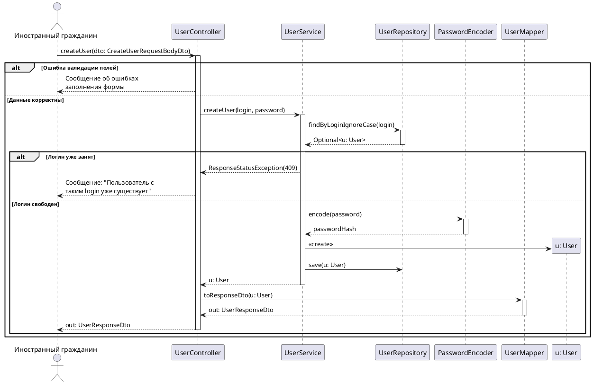
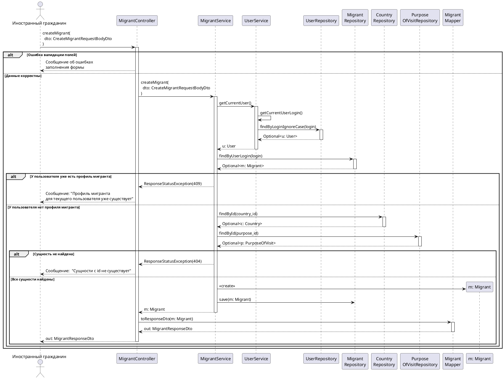
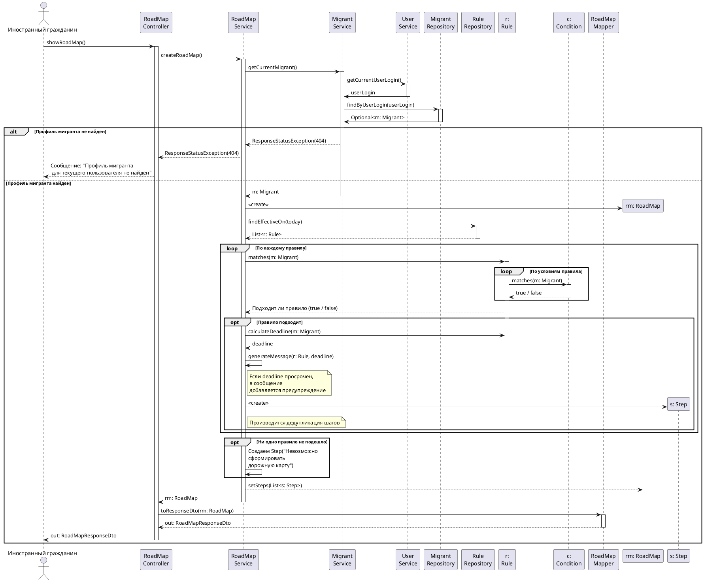
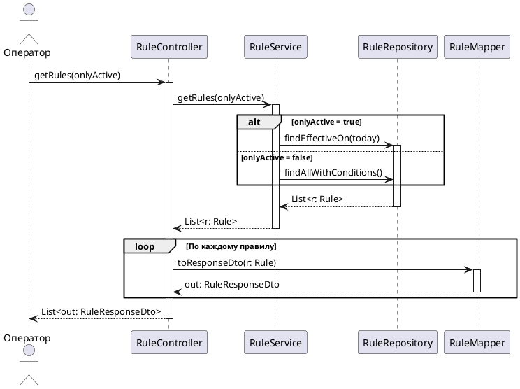
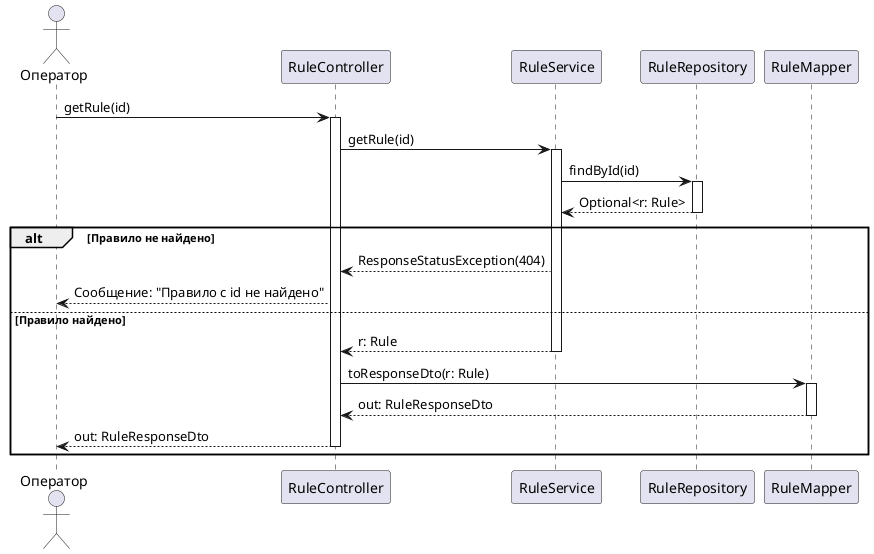
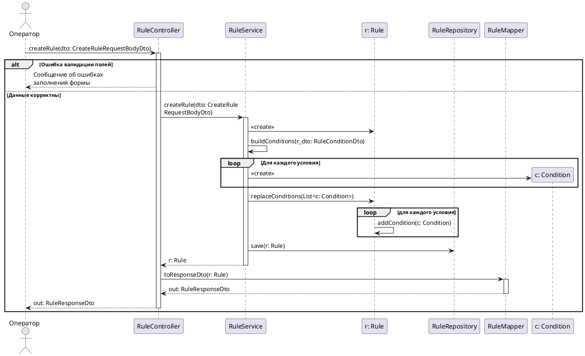
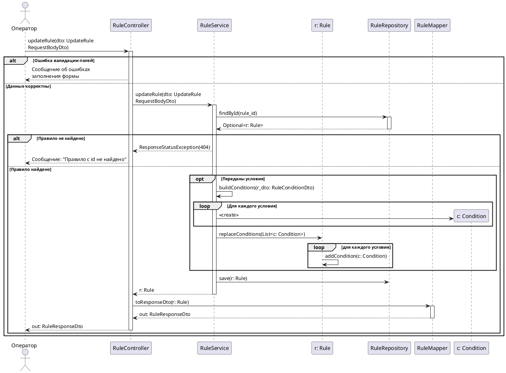
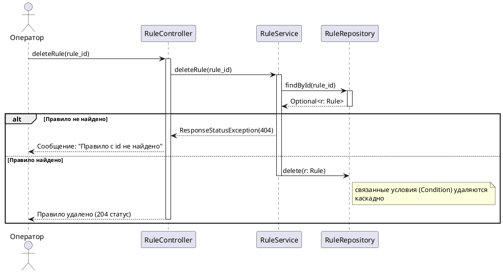

# Диаграммы последовательностей (взаимодействие объектов)
### Система помощи мигрантам

Проектные диаграммы последовательностей — по одной на каждую системную функцию из SSD.
Система раскрыта на реальные объекты (контроллеры, сервисы, репозитории, доменные классы,
мапперы). Нотация PlantUML (рендер: plantuml.com / плагин IDE).

**Условные обозначения:** `alt/else` — взаимоисключающие исходы; `loop` — повторение;
`opt` — необязательная ветка; самосообщение объекта — внутреннее действие. Полосы активации
опущены для надёжного рендеринга; при необходимости добавляются.

---

## Прецедент «Регистрация» → createUser

---

## Прецедент «Внесение данных о себе» → createMigrant

---

## Прецедент «Просмотр дорожной карты» → showRoadMap

---

## Прецедент «Управление правилами»

### getRules — список правил

### getRule — одно правило

### createRule — создание правила с условиями

### updateRule — редактирование правила

### deleteRule — удаление правила

