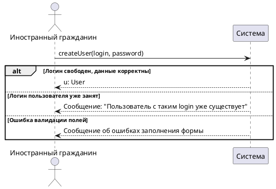
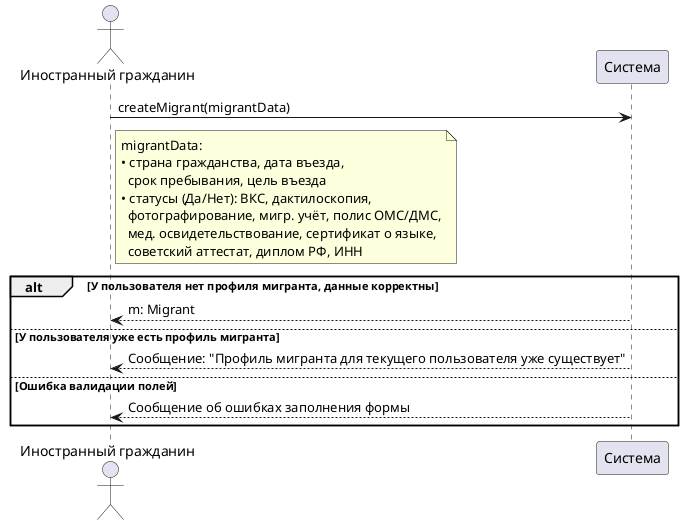
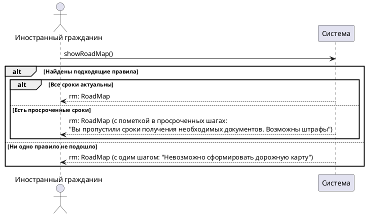
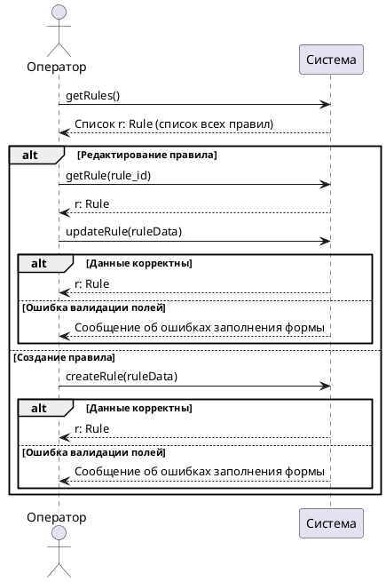
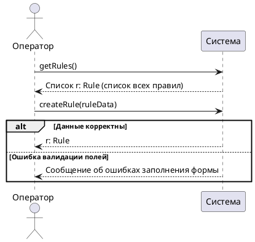
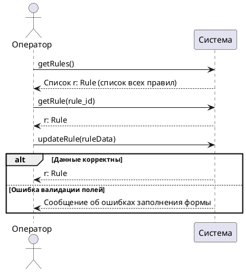
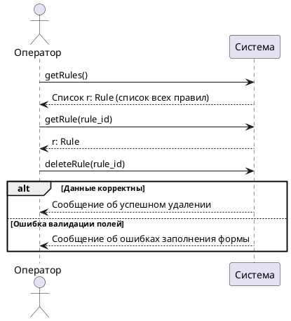

Понял — это системные диаграммы последовательностей (SSD): Система как единый чёрный ящик, только сообщения «действующее лицо ↔ Система», имена операций без внутренних классов. По одной на прецедент, основной сценарий + существенные альтернативы из твоих спецификаций.

**Регистрация** (осн. + «логин занят» 3a + валидация):

**Внесение данных о себе** (осн. + проверка корректности):

**Просмотр дорожной карты** (осн. + «нет подходящих правил» 3a + «просрочка» 4a):

**Управление правилами** (осн.: список + сохранение + «ошибка валидации» 6a):

